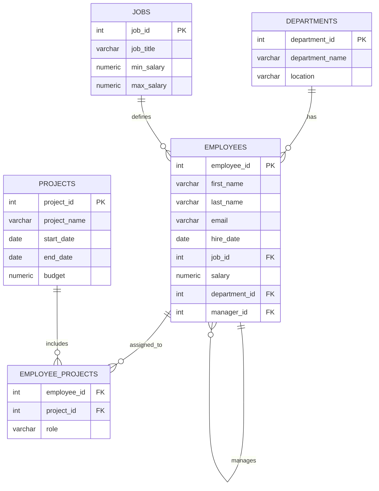

# HR Employee Management — SQL Mini Project

A beginner-friendly SQL project simulating a small company's HR database.
Built for PostgreSQL, it covers core SQL skills: `SELECT`, filtering, `JOIN`s
(inner, left, self), `GROUP BY`/`HAVING`, aggregate functions, and basic
subqueries.

##  Schema



##  Files

| File | Purpose |
|---|---|
| `hr_employee_management.sql` | One self-contained file: schema, seed data, all 15 queries, and each query's real output as a comment block underneath it |

##  Setup

```bash
createdb hr_mini_project
psql -d hr_mini_project -f hr_employee_management.sql
```

The output comments in the file were generated by actually running this exact
schema and data — they're not hand-written guesses. Re-running the file
yourself should reproduce the same results.

##  What this project demonstrates

- Relational schema design (1-to-many, many-to-many, self-referencing FK)
- Filtering with `WHERE`, `BETWEEN`, `ORDER BY`
- `INNER JOIN`, `LEFT JOIN`, and self-joins (manager hierarchy)
- Aggregation with `GROUP BY`, `HAVING`, `COUNT`, `AVG`, `SUM`
- Correlated subqueries (top earner per department)
- Finding "anti-joins" (employees with no project) via `LEFT JOIN ... IS NULL`

##  Possible extensions

- Add window functions (e.g. `RANK()` for salary per department)
- Add a `departments.manager_id` FK for department heads
- Build a small dashboard on top with Python + pandas or a BI tool


